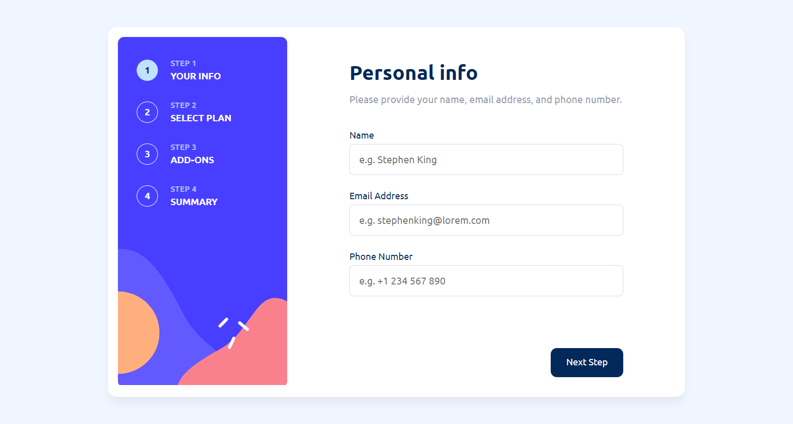

# Frontend Mentor - Multi-step form solution

This is a solution to the [Multi-step form challenge on Frontend Mentor](https://www.frontendmentor.io/challenges/multistep-form-YVAnSdqQBJ).

## Table of contents

- [Overview](#overview)
  - [The challenge](#the-challenge)
  - [Screenshot](#screenshot)
  - [Links](#links)
- [My process](#my-process)
  - [Built with](#built-with)
  - [Continued development](#continued-development)
- [Author](#author)

## Overview

### The challenge

The challenge required the user to be able to:

- Complete each step of the sequence
- Go back to a previous step to update their selections
- See a summary of their selections on the final step and confirm their order
- View the optimal layout for the interface depending on their device's screen size
- See hover and focus states for all interactive elements on the page
- Receive form validation messages if:
  - A field has been missed
  - The email address is not formatted correctly
  - A step is submitted, but no selection has been made

### Screenshot

### Links

- Solution URL: [Multi step form solution](https://www.frontendmentor.io/solutions/responsive-step-form-using-react-2oI5N0Euns)
- Live Site URL: [Multi step form preview](https://stepform-alexander.netlify.app/)

## My process

### Built with

- React
- Hooks
- Semantic HTML5 markup
- CSS custom properties
- Flexbox
- Mobile-first workflow

### Continued development

I would like to improve the reusability of components and classes. I need to improve the declaration of classes to be more consistent with BEM principles.

## Author

- Website - [Alexander Guillén Hernández](https://alexanderguillen.netlify.app/)
- Frontend Mentor - [@AlexanderTheWise](https://www.frontendmentor.io/profile/AlexanderTheWise)
- [Linkedin](https://www.linkedin.com/in/alexander-gh)
